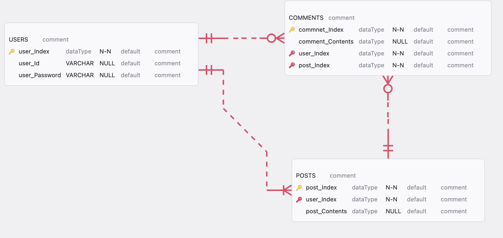
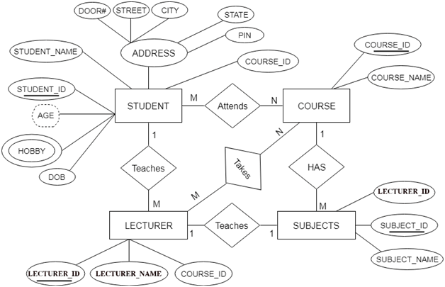
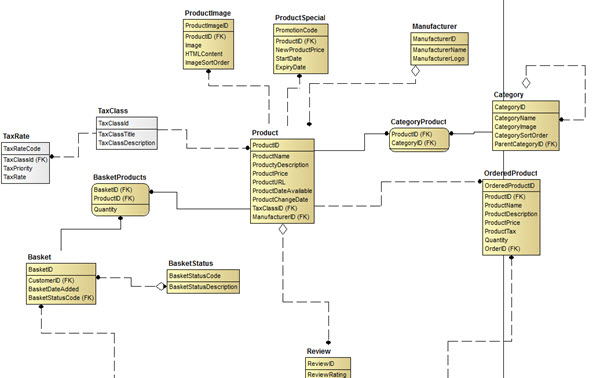

- 외래키

   > 💡    관계형 데이터베이스에서 한 테이블의 필드중 다른 테이블의 행을 식별할수 있는 키

    만약 하나의 테이블에 모든 정보를 저장한다고 해보자.

    간단하게 회원시스템을 구축하고, 각 회원은 게시물을 올리고 댓글도 달수 있는 서비스가 있다고 할 때

    유저 데이터베이스에는 모든정보(유저 아이디, 비밀번호, 게시물, 댓글정보, 등등..) 이 담겨 있어야한다.

    

    모든 정보가 USERS 테이블에 같이 있는 모습

    이런 설계에서 한명의 유저가 여러 개의 게시물을 올리면 그만큼 아이디,비밀번호가 중복되는 행이 생길것이고, 이는 데이터중복관점에서, 보안관점에서 매우 좋지 않다. 또한 데이터베이스를 보고 해석할 때도 불필요한 정보가 너무 많기에 한번에 파악하는게 쉽지 않을 것이다.

    이를 해결하기 위해 각 데이터의 성격에 따라 테이블을 분리하고, 다른 테이블의 기본키를 참조하게 되는데. 이럴 때 필요한 것이 외래키(Foreign Key, FK)다.

    

    FK를 사용해 테이블을 데이터 성격에 따라 분리했다.

- 기본키

    >💡    관계형 데이터베이스에서 식별자로 이용하기에 가장 적합한 키

    학생 정보을 저장하는 테이블이 있다고 생각해보자

    만약 ‘홍길동’ 이라는 학생의 이름만 가지고 전화번호를 찾고 싶은데 컴퓨터공학과 홍길동과, 경제학과 홍길동이 존재하면 과연 어떤 홍길동이 내가 찾고 싶어하는 홍길동인지 알 수 없다.

    | 이름 | 학과 | 전화번호 |
    | --- | --- | --- |
    | 홍길동 | 컴퓨터공학과 | 010-1234-1234 |
    | 홍길동 | 경제학과 | 010-5241-1235 |

    테이블에 중복된 정보가 있을때 이를 유일하게 구분해주는것이 기본키이다.

    | 학생 ID | 이름 | 학과 | 전화번호 |
    | --- | --- | --- | --- |
    | 1 | 홍길동 | 컴퓨터공학과 | 010-1234-1234 |
    | 2 | 홍길동 | 경제학과 | 010-5241-1235 |

    위 예시에선 학생 ID를 기본키(Primary Key, PK) 라고 할 수 있다.

- ER 다이어그램

    
    

    ER 다이어그램(Entitiy-Relationship Diagram, ERD)는 데이터베이스를 설계기 위해 만든 다이어그램이다. 각 데이터간의 관계와 종속성을 표현해 한 눈에 데이터베이스를 파악할 수 있게 한다.

    ERD는 3가지 요소로 구분된다.

    1. Entity(엔티티) : 관리하고자 하는 정보의 실체로서 현실에 존재한다 e.g) 학생, 교수, 수업
    2. Attribute(속성) : 관리하는 엔티티가 가지는 속성 e.g) 학생 - 학생 ID, 이름, 주소
    3. Relationship(관계) : 둘 이상의 엔티티간의 관계 혹은 상호작용

- 복합 키

    > 💡    두 개 이상의 칼럼으로 구성된 기본키, 하나의 칼럼으론 고유성을 보장하기 어려울때 사용된다.

    각 도서관의 정보를 관리하는 시스템이 있다고 해보자.

    도서관 한곳에서 책을 관리한다고 하면 도서코드를 기준으로 DB를 설계하면 충분 할 것이다.

    하지만 다른 도서관에서는 같은 책이 있을 수 있으니 도서코드만으로 정보의 유일성을 보장 할 수 없다.

    | 도서코드 | 작가 |
    | --- | --- |
    | 1234 | A |
    | 5678 | B |

    A 도서관

    | 도서코드 | 작가 |
    | --- | --- |
    | 1234 | 가 |
    | 5462 | 나 |

    가 도서관

    도서관리 시스템을 A 도서관에서만 쓴다면 문제가 되지 않겠지만. 각 도서관의 정보를 관리하는 상위 체계가 있다고 하면 A 도서관과 가 도서관에서 충돌이 발생할 것이다.

    위 DB에서 도서관 위치를 새로운 속성으로 하는 열을 추가하고 도서코드와 함께 복합키로 설정한다면 유일성을 보장 할 수 있을 것이다.

    | 도서코드 | 작가 | 도서관 |
    | --- | --- | --- |
    | 1234 | A | A |
    | 5678 | B | A |

    A 도서관

    | 도서코드 | 작가 | 도서관 |
    | --- | --- | --- |
    | 1234 | 가 | 가 |
    | 5462 | 나 | 가 |

    가 도서관

- 연관관계
    > DB 내에서 테이블 간의 관계, 주로 ERD에서 선으로 표현된다.

    테이블에서 FK를 사용해서 이를 표현한다. 총 3가지 관계가 있다.

    1. 1 대 1 관계 ( one to one )

        두 테이블 간에 각각의 레코드가 다른 테이블의 단 하나의 레코드에만 연결되는 관계이다.

        예를들어 회원정보를 저장하는 USERS 테이블과 회원의 프로필사진을 저장하는 USERPROFILES 테이블이 있다면 회원은 하나의 프로필사진을 가지므로 일대일 관계이다.

    2. 1 대 다 관계 ( one to many )

        한 테이블의 레코드가 다른 테이블의 여러 레코드에 연결될 수 있는 관계이다.

        예를 들어, ⁠Customers 테이블과 ⁠Orders 테이블이 있을 때, 한 고객은 여러 주문을 할 수 있으므로 일대다 관계이다.

    3. 다 대 다 관계

         두 테이블의 레코드가 서로 여러 개의 연결을 가질 수 있는 관계이다.

         예를 들어, ⁠Students 테이블과 ⁠Courses 테이블이 있을 때, 한 학생은 여러 과목을 수강할 수 있고, 여러 학생이 하나의 과목을 수강할 수 있으므로 다대다 관계입니다.

- 정규화
    > 데이터의 중복성을 허락하지 않음으로서 데이터의 무결성을 유지하도록 하는 프로세스

    데이터 정규화는 총 단계에 따라 5단계 까지 수행할 수 있다.

    1. 제 1 정규형 (1NF): 모든 열이 원자값을 가지며, 중복된 그룹이 없어야 한다.

    2. 제 2 정규형 (2NF): 1NF를 충족하며, 부분 함수 종속이 없어야 한다.
    3. 제 3 정규형 (3NF): 2NF를 충족하며, 이행적 종속이 없어야 한다.
    4. 제 4 정규형 (BCNF): 모든 결정자가 후보 키여야 하며, 다치 종속이 없어야 한다.
    5. 제 5 정규형 (5NF): 모든 조인 종속이 후보 키에 의존해야 하며, 조인에 의해 불필요한 데이터 중복이 없어야 한다.

- 반 정규화
    > 정규화된 데이터 모델의 성능을 개선시키기 위해 사용 되는 프로세스

    데이터 정규화를 통해 데이터의 무결성을 유지할 수 있지만, 너무 과도하게 정규화를 수행 할 경우 너무 많은 조인 연산이 발생 하게 되어 성능이 떨어지게 될 수 있다.

    이를 예방하기 위해 데이터 중복을 허용하거나, 테이블을 결합하는 과정을 거친다.

    결국 정규화-반정규화 이 두 과정은 성능과 무결성을 Trade-OFF하는 과정으로 서비스에 따라 적정한 수준의 정규화를 거쳐야한다.
