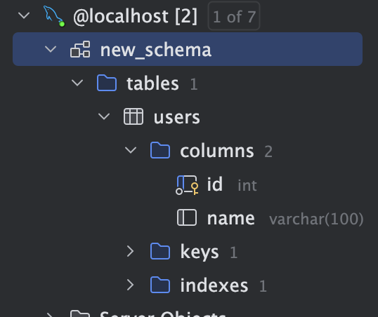

# ES
    
    **ECMA스크립트**(ECMAScript, 또는 ES)란,
    
    Ecma International이 **ECMA-262** 기술 규격에 따라 정의하고 있는 표준화된 스크립트 프로그래밍 언어를 말한다.
    
    자바스크립트를 표준화하기 위해 만들어졌다. 액션스크립트와 J스크립트 등 다른 구현체도 포함하고 있다. ECMA스크립트는 웹의 클라이언트 사이드 스크립트로 많이 사용되며 Node.js를 사용한 서버 응용 프로그램 및 서비스에도 점차 많이 쓰이고 있다.
    
# ES6
    ## ES6의 주요 변화 및 특징
        1. let, const 키워드 추가(기존의 변수는 함수 scope를 가진 var 키워드를 선언함)
        2. arrow 문법 지원(익숙하면 편하고 간편해진 코드를 작성할 수 있음, this를 바인딩하지 않음)
        3. iterator/generator 추가
        4. module import / export 추가
        5. Promise 도입(Callback Hell을 해결해줄 기법이 추가됨)
        6. Default, Rest 파라미터
        7. 해체 할당, Spread 연산자
        8. 템플릿 리터럴
        9. 호이스팅이 사라진 것 같은 효과
        10. 함수 단위 스코프에서 블록 단위 스코프로 변경
    ## ES6를 중요시 하는 이유
        ES6는 자바스크립트의 여러 새로운 문법과 개념을 도입했습니다. 이러한 변화는 자바스크립트 언어의 한계를 넘어서는 데 중요한 역할을 했습니다. ES6의 대표적인 특징으로는 let과 const를 이용한 블록 스코프 변수 선언, 화살표 함수, 클래스, 모듈 시스템, 템플릿 리터럴, 기본 매개변수, 비구조화 할당 등이 있습니다.
        
# ES Module
    - ES6에 도입된 모듈 시스템.
    - import, export를 사용해 분리된 자바스크립트 파일끼리 서로 접근할 수 있다.
    - entry 파일의 구문 분석 후 의존성(import)을 확인해서 해당 의존성 파일을 찾아서 다시 구문 분석을 반복한다.
    - 파일을 불러오는 동안 **주 스레드를 차단하지 않는다.**
    - 인스턴스화, 평가는 더 이상 구문 분석할 의존성이 발견되지 않으면 실행한다
    - 그렇기에 모듈 지정자에 변수를 넣을 수 없다(다만 동적 import를 쓰면 가능)
    - export는 **참조**를 반환하는 함수를 정의한다.
    - 동적 import는 별개의 entry 파일로 취급되어 새로운 그래프를 만든다.
# 프로젝트 아키텍처
    ## 프로젝트 아키텍처가 중요한 이유
        1. 명확한 구조 제공:
            - 프로젝트 아키텍처는 시스템의 전체 구조를 명확하게 정의한다. 이를 통해 팀원들이 시스템의 구성 요소와 상호 작용을 명확하게 이해할 수 있게 한다.
        2. 효과적인 의사소통 촉진:
            - 프로젝트 아키텍처 문서는 프로젝트 이해관계자 간의 공통 이해를 촉진한다. 이를 통해 개발팀, 관리팀, 고객 모두가 동일한 목표와 방향을 공유할 수 있게 한다.
        3. 일관성 유지:
            - 아키텍처는 프로젝트 전반에 걸쳐 일관성을 유지하도록 한다. 모든 팀원이 동일한 표준과 규칙을 따르기 때문에 개발 과정에서 혼란을 줄일 수 있다.
        4. 재사용성 향상:
            - 잘 설계된 아키텍처는 코드와 구성 요소의 재사용성을 높인다. 이를 통해 개발 시간과 유지보수 비용을 줄일 수 있게 한다.
        5. 위험 관리:
            - 프로젝트 아키텍처는 잠재적인 위험 요소를 식별하고 이를 완화할 계획을 수립하도록 한다. 이를 통해 프로젝트 실패의 가능성을 줄일 수 있다.
        6. 성능 및 확장성 보장:
            - 초기 단계에서 적절한 아키텍처 설계를 통해 시스템의 성능과 확장성을 보장할 수 있게 한다. 이는 프로젝트가 성장하고 더 많은 사용자와 데이터를 처리할 수 있도록 하는 데 중요하다.
        7. 보안 강화:
            - 프로젝트 아키텍처 문서는 보안 요구 사항과 방법을 포함한다. 이를 통해 데이터 보호, 접근 제어, 인증 및 권한 부여 메커니즘을 정의할 수 있게 한다.
        8. 자원 관리 효율화:
            - 아키텍처는 프로젝트에 필요한 자원을 정의하고 할당하도록 한다. 이를 통해 자원의 낭비를 줄이고 효율성을 극대화할 수 있게 한다.
        9. 개발 및 유지보수 용이:
            - 명확한 아키텍처는 개발 과정 뿐만 아니라 유지보수 과정에서도 큰 도움을 준다. 새로운 기능을 추가하거나 버그를 수정할 때 시스템 구조를 쉽게 이해하고 접근할 수 있게 한다.
        10. 프로젝트 일정 관리:
            - 아키텍처는 프로젝트의 주요 마일스톤과 일정을 정의하도록 한다. 이를 통해 프로젝트 진행 상황을 모니터링하고 프로젝트가 제시간에 완료되도록 할 수 있다.
    ## Service-Oriented Architecture(Service Layer Pattern)
        
        ### 서비스 계층(Service Layer) 이란?
        
        서비스 계층(Service Layer), 다른 이름으로는 비즈니스 로직 계층(Business logic layer)은 아키텍처의 가장 핵심적인 비즈니스 로직을 수행하고 클라이언트가 원하는 요구사항을 구현하는 계층입니다.
        
         서비스(Service)는 데이터가 필요할 때 저장소(Repository)에게 데이터를 요청합니다
        
         어플리케이션의 핵심적인 비즈니스 로직을 수행하여 클라이언트들의 요구사항을 반영하여 원하는 결과를 반환해주는 계층입니다.
        
    ## MVC 패턴
        
        **MVC (Model-View-Controller)**
        
        모델(데이터), 뷰(사용자 인터페이스), 컨트롤러(로직)으로 나뉨
        
        각 구성 요소를 독립적으로 변경할 수 있어 유지보수가 쉽지만 작은 프로젝트에선 복잡도가 증가할 수 있음
        
    - 그 외 다른 프로젝트 구조
        - MVC와 같은 계층형 구조 외에 도메인형 구조도 존재한다.
# 비즈니스 로직
    - 소프트웨어 공학에서 사용하는 비즈니스는 **"소프트웨어가 해결해야하는 현실 세상의 문제"**를 의미하는 단어다.
    - 로직(Logic)은 소프트웨어가 특정 작업을 수행하는 과정이나 절차라고 말할 수 있다.
    - 즉, **비즈니스 로직**은 **"소프트웨어가 현실 세계의 문제를 해결하는 방법을 구체적으로 구현한 것"** 이라고 정의할 수 있다. 달리 말해, "애플리케이션의 비즈니스 요구 사항을 구현한 코드"라고 말할 수도 있다.
    
    ### 예시) 고객이 상품을 구매할 수 있어야 한다.
    
    - 사용자가 구매할 수 있는 상품 목록을 표시한다. (상품 데이터를 서버로부터 가져와서 UI에 반영하는 로직)
    - 사용자가 구매하고자 하는 상품을 클릭해서 장바구니에 담는다. (선택된 상품을 장바구니 데이터 구조에 저장하는 로직)
    - 사용자가 상품을 결제한다. (총 금액이 얼마인지 계산하고, 올바른 결제 수단을 선택했는지 검증하고, 사용자의 이벤트를 받아 서버로 결제 요청을 전송하는 로직 등)
# DTO
    - DTO(Data Transfer Object, 데이터 전송 객체)란 프로세스 간에 데이터를 전달하는 객체를 의미합니다. 말 그대로 데이터를 전송하기 위해 사용하는 객체라서 그 안에 비즈니스 로직 같은 복잡한 코드는 없고 순수하게 전달하고 싶은 데이터만 담겨있습니다.

