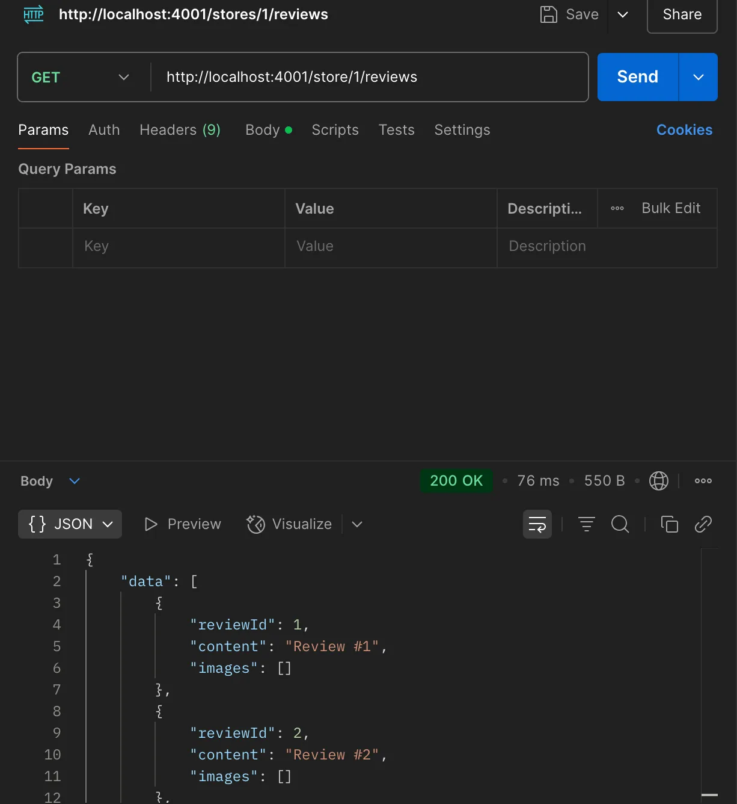
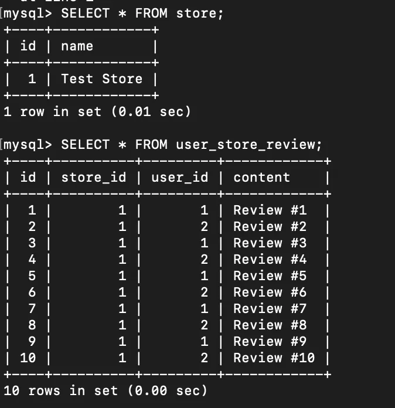
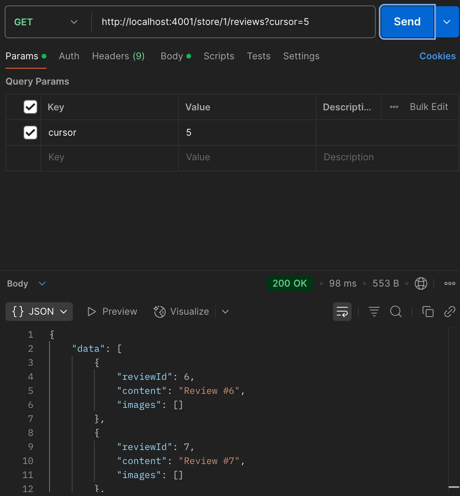
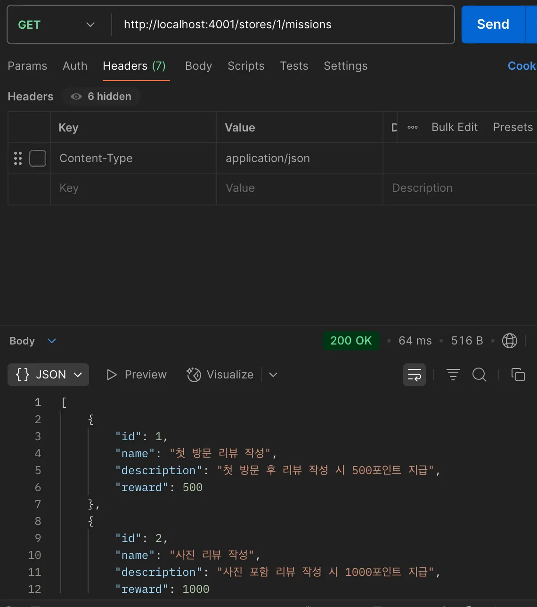
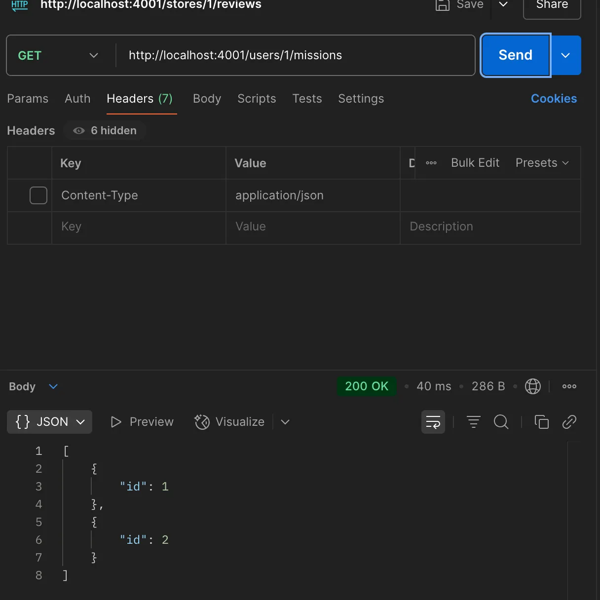

#내가 작성한 리뷰 목록 API
- 참고 화면을 보면, 특정 가게에 자신이 작성한 리뷰 목록을 조회함
===
#Controller 로직
```
export const handleListStoreReviews = async (req, res, next) => {
  try {
    console.log("리뷰 목록 요청:", req.params.storeId, req.query.cursor);
    const storeId = parseInt(req.params.storeId); // {stordId}
    const cursor = typeof req.query.cursor === "string"
      ? parseInt(req.query.cursor)
      : 0;

    const result = await listStoreReviews(storeId, cursor); // 
    res.status(StatusCodes.OK).json(result);
  } catch (err) {
    console.error("리뷰 목록 에러:", err);
    next(err);
  }
};
```
- GET //store/{storeId}/reviews 요청을 받으면 review.controller에 handleListStoreReviews를 호출한다.
- storeId와 cursor 정보를  service 계층으로 전달한다. HTTP 상태코드 200 전달
- 에러가 발생하면 다음 미들웨어로 넘김. next(err)
#Service 로직
```
export const listStoreReviews = async (storeId, cursor) => {

  const reviews = await getStoreReviews(storeId, cursor);
  const data = reviews.map(responseFromReview);
  
  return responseFromReviews(data);
};
```
- getStoreReviews 함수를 호출하고 Prisma ORM을 사용해서 DB에서 리뷰 데이터를 가져온다.
- DB에서 가져온 데이터를 responseDTO 형태로 변환한다.
- responseFromReviews(DTO)를 사용해서 원하는 형태로 가공해서 반환한다.
#Repository 로직
```
export const getStoreReviews = async (storeId, cursor) => {
  return prisma.userStoreReview.findMany({
    where: {
      storeId: storeId,
      id: { gt: cursor }
    },
    select: {
      id: true,
      content: true,
      user: {
        select: {
          id: true,
          name: true
        }
      }
    },
    orderBy: { id: "asc" },
    take: 5
  });
};

```
- userStoreReview 테이블에서 데이터를 가져온다.
- findMany는 여러 데이터를 가쟈오는 Prisma 메서드
- where절을 보면, storeId가 일치하고, cursor보다 큰 것만.
- 커서 페이지네이션을 위해 리뷰 id 오름차순으로 정렬한다.
- 최대 5개를 가져온다.
#DTO
```
export const responseFromReviews = (data) => {
  return {
    data,
    pagination: {
      cursor: data.length ? data[data.length - 1].reviewId : null
    }
  };
};
```
- data 배열 안에는 responseFromReview로 변환된 리뷰 data들이 있다.
- pagination.cursor는 다음 페이지에서 사용할 커서 값이다.
- cursor: data.length ? data[data.length - 1].reviewId : null
- data[data.length - 1] : 마지막 리뷰의 reviewId를 cursor로 사용한다.

- 조회 성공

- DB 더미 데이터

- 커서 사용

- 가게 미션 조회 API

- 유저 미션 조회 API
